# Pantry Manager
The Pantry Manager application is a Java-based web application. It needs to be deployed in Apache Tomcat to run, and utilizes an embedded HyperSQL database (HSQLDB). By virtue of being a java-based application, it should run on any OS that supports both Java 8+ and Tomcat 8+.

## Requirements:

This application requires Java 8+ (JRE) and Tomcat 8+ to be installed in order to run. Additionally, it is accessible via web browser only. Storage requirements will vary based on the amount of items and recipes created during the regular use of this application.

## About:

This application is intended to be used to track the food in your pantry, and if there are any (user-defined) recipes, it will allow you to indicate you are cooking one and remove the appropriate quantities of the associated ingredients from your pantry. In addition, it can be used to track quantities of anything as desired.

The application currently contains two pages. One page manages the current inventory of your pantry, and the other page manages all recipes and associated ingredients. Additional pages such as a "Available Recipes" and "Recently Cooked" are planned for future releases. Planned future development can be viewed at https://trello.com/b/oiFO6FA9/pantry-inventory-tracker

## Installation:

To run this application, Tomcat must first be installed and running. Once Tomcat is running, the .WAR file should be copied into the webapps folder of your Tomcat home directory (e.g. C:\Program Files\tomcat\webapps).

The application is accessible via any web browser by navigating to http://localhost:8080/inventory. Additionally, it can be accessed from other devices on the network by navigating to the IP address of the hosting machine in place of "localhost" (e.g. http://192.168.1.12:8080/inventory)

## Usage:

Pages are navigated via the menu bar at the top of the page. The currently selected page will display in tan lettering while the unselected page will appear in green lettering.

## Inventory Page:

The View Inventory page displays all items that have been created and stored in the database. This display includes the name of the recipe, the quantity currently available (which should reflect the quantity in the user's pantry), and the units the item is being stored in.

<a href="./img/InventoryMain.PNG">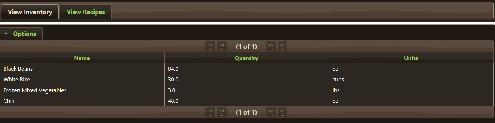</a>

New items can be created via the "New Item" in the Options menu. Enter a unique name, starting quantity (minimum of 0.0), and the units being referenced (e.g. oz, lb, c, L, kg, etc.). It is recommended that units be an easily quantifiable amount rather than something more variable such as "can" or "bag". If a user enters a name that is already in use, the item creation will fail and the user will be alerted that the name is already in use.

<a href="./img/InventoryOptionsBlank.PNG">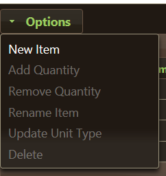</a> <a href="./img/NewItemPopup.PNG">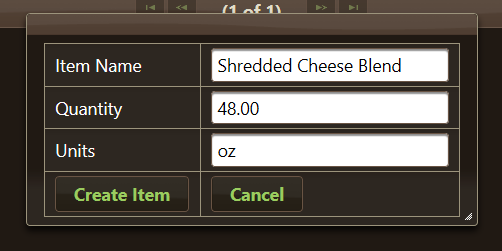</a>

Once an item has been created, it will be displayed in the data table. Rows in this table are selectable, in order to allow users to modify various aspects of the item. Once a row has been selected, additional actions will be available in the Options menu. These are as follows: Add Quantity, Remove Quantity, Rename Item, Update Unit Type, and Delete. All actions have a "Cancel" button that will leave the selected item unaffected.

<a href="./img/InventoryOptionsSelected.PNG">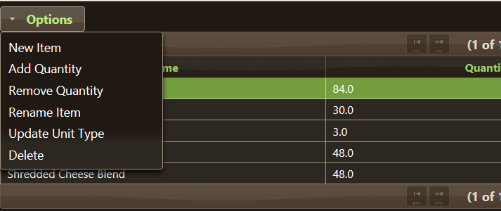</a>

Both Add and Remove Quantity will prompt the user for a quantity. This is expected to be a positive number for both actions. Using a negative number is permitted, it just inverts the addition or subtraction. Once a user has entered the value and clicks Submit, the quantity will be added or removed from the total amount listed. Items cannot be set to less than 0 quantity via these actions. 

<a href="./img/AddQtyItem.PNG">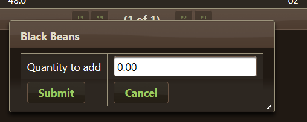</a>

Items can be renamed in the event a typo is made, or a different name is desired (e.g. Changing to "Black Beans" instead of "Beans"). The Rename Item action will prompt users for a new name. Upon clicking Submit, the name of the item will be changed. As with creating items, if the new name is the same as an existing item, this action will fail with a message provided to the user.

Unit values can also be updated via the Update Unit Type action. This would be used if a user intitially enters a value say in "pounds" but wants to reference recipes in "ounces" to avoid decimal values. Upon clicking Submit, the value will be updated. Users will likely want to change the quantity of the item if the units are changed.

<a href="./img/ItemUpdateUnits.PNG">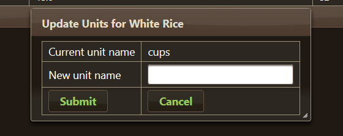</a>

The final action is Delete. This will prompt users to confirm that the selected item should be deleted. The item must not be used as a part of any Recipe in order for this to succeed. This action is not automatically reversible. Users must recreate the item if it was deleted by mistake.

<a href="./img/ItemConfirmDelete.PNG">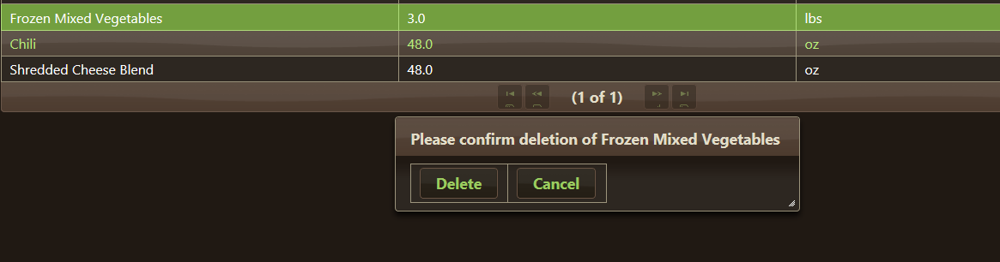</a>

## Recipe Page:

The Recipe page is divided into two sections. A smaller panel on the left-hand side and the main central panel. This page will list all available recipes on the left-hand panel in a selectable table. When selected, the central panel will be updated to show a listing of all the ingredients used in the recipe.

<a href="./img/RecipeCleared.PNG">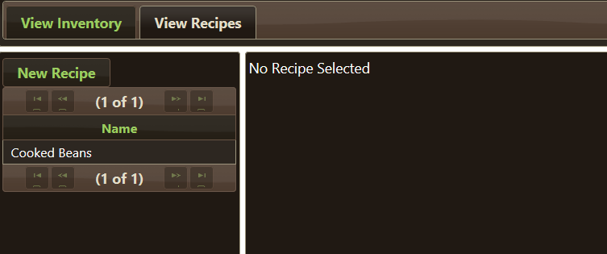</a>

To create a new recipe, users should click the New Recipe button on the left-hand panel. Users need to provide a unique name for the recipe before clicking "Submit". Upon successfully creating a new recipe, it will become the currently selected recipe.

To select a different recipe to display, click on the recipe name in the data table on the left-hand side. Once selected, the recipe's ingredients will be listed in the central panel.

<a href="./img/RecipeSelected.PNG">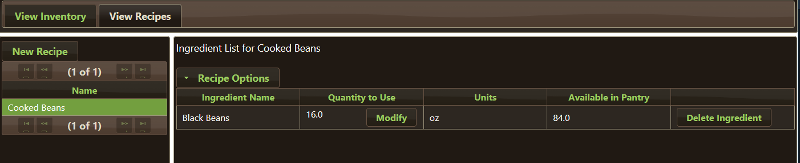</a>

The central panel will also show the name of the currently selected recipe and a list of actions for the recipe itself that can be taken under the "Recipe Options". Additionally, actions for individual ingredients will be available as buttons on each row in the list of ingredients. The Recipe Options contain the following actions: Add Ingredient, Cook Recipe, and Delete Recipe. Actions for the individual ingredients are "Modify" to change the quantity used and "Delete Ingredient". Units and quantity available in pantry are pulled from the items stored in the database.

<a href="./img/RecipeOptions.PNG">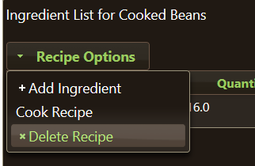</a>

To add an ingredient to a selected recipe, select the Add Ingredient action. Users will be prompted to enter a name for an ingredient, the quantity used and the units of that ingredient. The name should match up exactly to an item in the user's pantry. This associates it to the item in the database. If the name does not match any item in the pantry, a new item will be created in the pantry with the provided name and units, and with a quantity of 0. Once the user clicks Submit, the new ingredient will be listed in the central data table for the recipe.

<a href="./img/NewIngredient.PNG">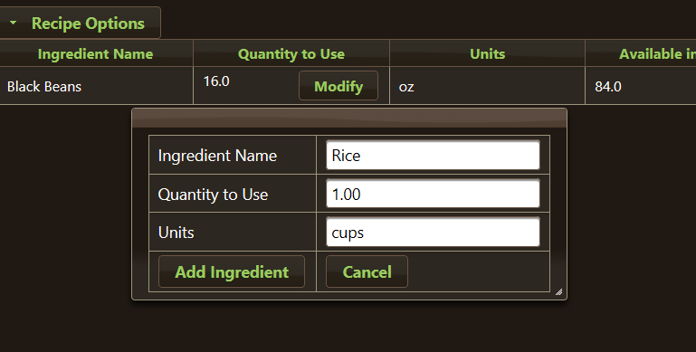</a>

<a href="./img/CreateItemFromIngredient.PNG">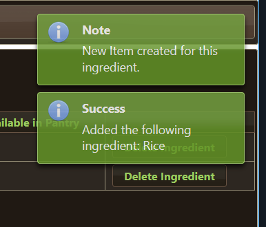</a>

The Cook Recipe action is only usable if the user has enough quantity of the associated items for each ingredient in the recipe currently available in their pantry. If this option is available, clicking the option will remove the ingredient quantity from each item in the user's pantry.

The Delete Recipe option will delete the recipe and all its associated ingredients. Users will be prompted to confirm that they want to delete the recipe, and upon clicking Delete in the prompte, the recipe will be deleted. As with deleting items, this is not automatically reversible. Users will have to manually recreate any deleted recipes.

For the ingredient actions, Modify will change the current quantity of the ingredient to use in the recipe. When clicked, users will be prompted with the new value to be used. When users click Submit, the value will be updated for that ingredient in the table.

<a href="./img/ChangeIngredientQuantity.PNG">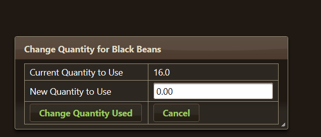</a>

Delete Ingredient will delete the ingredient from the recipe. Users will be prompted to confirm that the ingredient will be deleted from the recipe. Ingredients that are deleted will have to be recreated manually. There is no automated recovery for deleted items.

<a href="./img/IngredientDelete.PNG">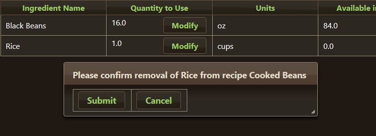</a>

## Contact
Issues can be filed against the project here. Additionally, feel free to contact me at **bjrudowski [at] gmail [dot] com** with any issues, suggestions, bugs, or comments in general about the project. I intend to keep the trello page up to date as I continue improving this application. https://trello.com/b/oiFO6FA9/pantry-inventory-tracker

